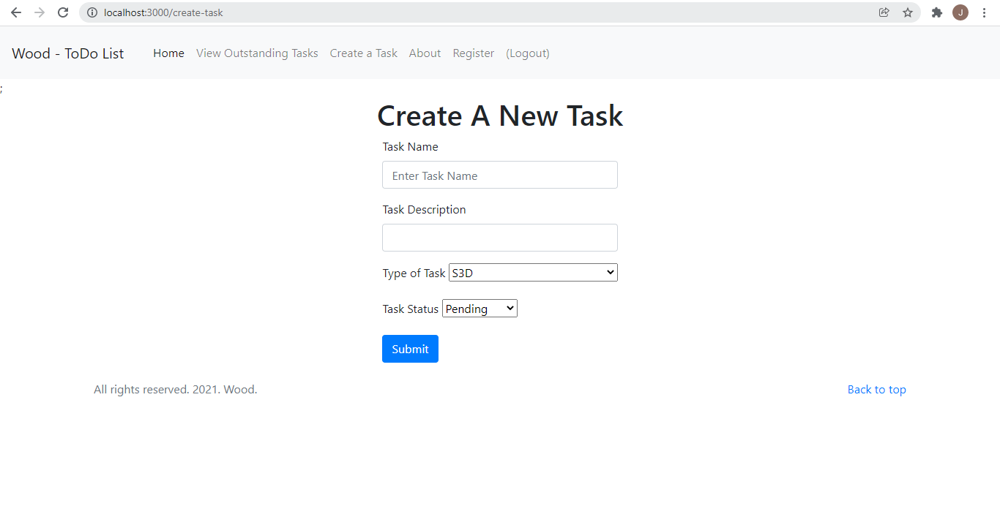
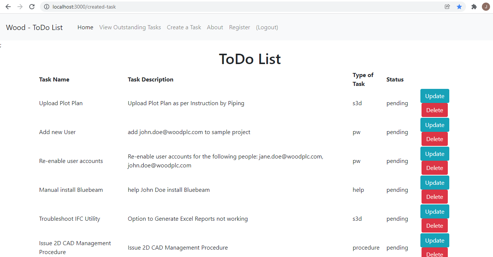

# To Do List App
Link to hosted web application:

Link to GitHub Repository:

## Introduction
The purpose of this application is to provide Wood Employees with the functionality to note down daily tasks and complete them during the day. At present, no "To Do List" tool is available, and users usually either keep a notepad or mentally note tasks. A survey conducted at the beginning of the project concluded that notepads are sometimes forgotten, causing users to use other means of note-taking, leading to inconsistency. The other method of mental note-taking (which accounted for 40% of employees' chosen note taking method) also resulted in human errors, where important information are sometimes forgotten. Therefore, a web tool accessible by anyone, at any time has been welcomed. The survey also reflected employee's request to keep the tool simple, therefore, the To Do List application has been limited to creating tasks and deleting them when they have been completed.

## System Overview
### MongoDB - Datastore

MongoDB is the database system used to house the data and has been chosen for its flexibility - it is a NoSQL database, with a dynamic Schema. MongoDB's NoSQL approach means its data is housed in the form of collections and documents (represented in a JSON-like format in the form of "key: value" pairs), allowing developers to have an adaptable Schema that does not implement a rigid structure on the documents (data records).

### Express - Application Framework
For the web application framework, Express is used. Express enables the user to interact with the database through the templating language of EJS. In the case of the ToDo List application, the user interacts with the website, and the operations of creating and deleting tasks (data) is communicated to the database.

### Mongoose - Schema Validation
For the application's Schema validation, Mongoose (MongoDB's Object Data Modeling library is used). The below code snippet shows the Task Schema used in the application to define the document properties of tasks.

> ```lang-js
>const taskSchema = new Schema(
>   {
>      name: String,
>       description: String,
>       type: String,
>       status: String,
>   },
>   { timestamps: true },
>   { typeKey: '$type '}
>);
> ```

### MVC Stack

>```lang-js
>DB-STARTER-PROJECT
>│   README.md
>│   app.js
>│   ....
>└───models
>│   │   task.js
>│   │   user.js
>└───controllers
>│   │   task.js
>│   │   user.js
>└───views
>|   |   about
>│   │   main.ejs
>|   |   create-task.ejs
>|   |   create-user.ejs
>|   |   update.ejs
>|   |   user-login.ejs
>....
>```
MVC Architecture

**Model**
<br>
For the Model layer - the layer that allows for the handling of data - in the case of the To Do List application, it houses the Schema validation for the task and user data passed. 

**View**
<br>
The View layer is the interface that presents the information to the user - it also enables the user to interact with the database by rendering HTML pages. As can be seen from the application's MVC structure, it contains a number of different views. For example, the "create-task.ejs" view is responsible for presenting a form that enables a user to create a task, which is then submitted to the database as a document (Figure 1).
<br>
<br>

>Figure 1
<br>

**Controller**
<br>
The Controller layer is responsible for gathering data from the models and enables this data to be presented in a view. The controller is also responsible for handling HTTP requests. For example, the "task.js" controller defines the CRUD operations for the handling of data. The below code snippet shows the Delete operation for deleting a document (record) from the collection of tasks.

>```lang-js
>exports.delete = async (req, res) => {
>    const id = req.params.id;
>    try {
>       await task.findByIdAndRemove(id);
>        res.redirect("/created-task")
>    } catch (e) {
>        res.status(404).send({
>            message: `could not delete task ID:${id}.`,
>        });
>    }
>};
>```

## Evaluation
The creation of the To Do List application helped me understand the key concepts of creating an application: how the MVC architecture works together to handle data, present data, and enable operations for user interaction with data; the flexibility of MongoDB as a datastore; the functionality EJS provides in being a template that can be used for users to interact with data; NPM's ability to manage modules to aid in the functionality of the application (i.e. express, mongoose, body-parser etc), as well as the concept of a serverless infrastructure for deploying web applications.

The intention of the application was to help users keep track of daily tasks. The way I envisioned this would work is a user will log in to the application, and will be able to create a collection of tasks assigned only to them according to their login ID. However, due to time constraints I faced, this was not made possible. The functionalities the application was able to achieve were: Creating and Deleting tasks, Viewing Outstanding Tasks, Registering as a New User, and User Authentication to an extent. 

As it stands,  the application at present enables for the creation of tasks through the form displayed by "create-task.ejs", which is a representation of the "task.js" model that defines the Schema using the Create operation defined in the "task.js" controller. The result is outputted into a table within the "created-task.ejs" view (Figure 2).
<br>
<br>

>Figure 2

The "Delete" button shown in the "created-task" view enables users to delete tasks as they complete them. The initial intention was to also have a functional "Update" button where users can edit tasks and update their respective statuses. However, I could not troubleshoot and debug the errors that arose from the edit and update operations within the task.js controllers. 

Overall, the application is functional - it is able to create, list and delete tasks, but it is not able to assign tasks according to the user logged in, nor update them. However, for its basic functionality, it achieves the purpose of being able to note down tasks and deleting them as they are completed. To further improve the functionality of the application, I would have dedicated more time to debug errors, in order to fully understand and identify where I could have gone wrong.


